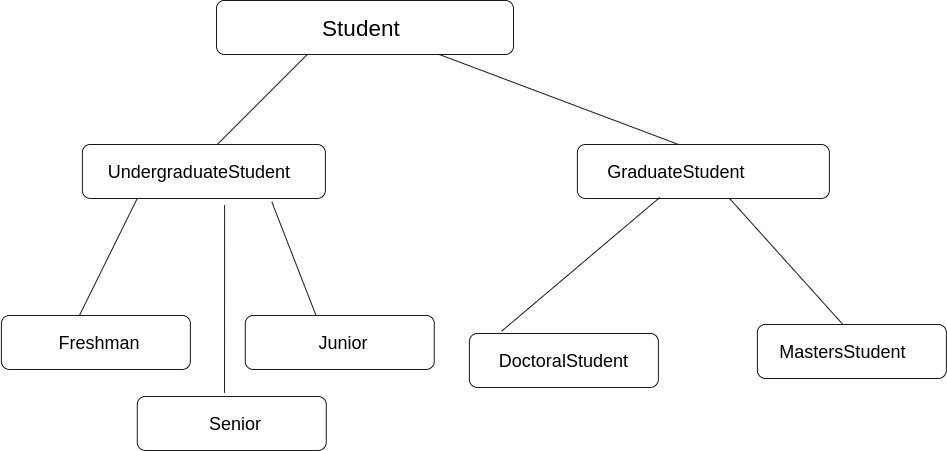

#answer 2




Here , Senior, junior, and freshman have inherited from the class Undergraduate student and the undergraduate student have inherited from the class student. 
Similarly Doctoral Student class and Masters student have inherited from Graduate student and Graduate student have also inherited from the Student class.
<br/>
<hr/>

#code

```
include<iostream>
using namespace std;

class Student {
public:
	void Study() {
		cout << "I will study after 2 hours" << "\n";
	}
};
class UndergraduateStudent: public Student {
public:
	void Btech() {
		cout << "I am doing Btech from GEU" << "\n";
	}

};
class Freshman: public UndergraduateStudent {
public:
	void Motivation() {
		cout << "i will score 10CGPA this sem" << "\n";
	}
};
class Junior: public UndergraduateStudent {
public:
	void coding() {
		cout <<  "My program works.. but i don;t know why?" << "\n";
	}
};
class Senior: public UndergraduateStudent {
public:
	void coding() {
		cout <<  "What am i doing here?" << "\n";
	}
};
class GraduateStudent: public Student {
public:
	void Knowledge()
	{
		cout << "I want to get more Knowledge" << "\n";
	}

};
class MastersStudent : public GraduateStudent {
public:
	void Master() {
		cout << "I will master this subject" << "\n";
	}
};
class DoctoralStudent : public GraduateStudent {
public:
	void Doctoral() {
		cout << "I will research new things in this subject" << "\n";
	}
};

int main() {

	Junior Gaurav;
	Gaurav.Btech();
	Gaurav.coding();
	Gaurav.Study();

	DoctoralStudent Tewari;
	Tewari.Doctoral();
	Tewari.Study();

}


```
