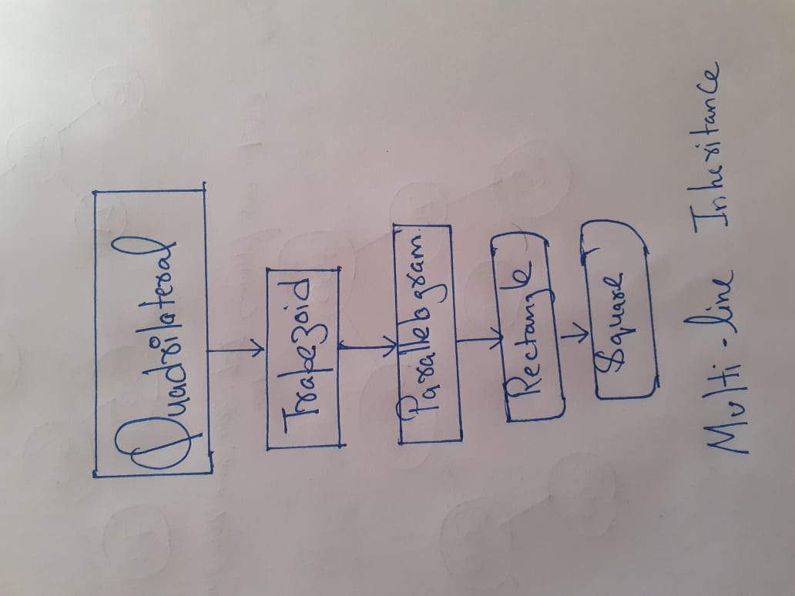

#code 
```
#include<iostream>
using namespace std;


class Quadrilateral {
public:
	void propertyofQuard() {
		cout << "A quadrilateral should be closed shape with 4 sides. All the internal angles of a quadrilateral sum up to 360°" << "\n";
	}
};
class Trapezoid: public Quadrilateral {
public:
	void propertyoTrapezoid() {
		cout << "A Trapezoid have parallel sides" << "\n";
	}
	//sum of parallel side... divided by 2 multipiled by height
	int areaTrapezoid(int a, int b, int h) {
		return (a + b) * h / 2;
	}
	int perimeterTrapezoid(int s1, int s2, int s3, int s4)
	{
		return s1 + s2 + s3 + s4;
	}
};
class Paralleologram : public Trapezoid {
public:
	void propertyofParalleogram() {
		cout << "A paralleologram have pair of parallel and equal sides" << "\n";
	}
	int areaPalleogram(int base, int height)
	{
		return base * height;
	}
	int perimeterPalleogram(int a, int b)
	{
		return 2 * (a + b);
	}
};
class Rectangle : public Paralleologram {
public:
	void propertyofRectangle() {
		cout << "It have a pair of parallel and equal sides and all angles are of 90deg." << "\n";
	}
	int areaRectangle(int a, int b)
	{
		return a * b;
	}
	int perimeterRectangle(int a, int b)
	{
		return 2 * (a + b);
	}
};
class Square : public Rectangle {

public:
	void propertyofSquare() {
		cout << "All sides of Square are equal and all angles of 90 deg" << "\n";
	}
	int areaSquare(int s) {
		return s * s;
	}
	int perimeterSquare(int s) {
		return 4 * s;
	}
};
int main() {


	Square cool;
	cool.propertyofQuard();
	cout << "area using Square with side 5 " << cool.areaSquare(5) << "\n";
	cout << "perimeter " << cool.perimeterSquare(5) << "\n";
	cout << "finding area of same Square using Rectangle's formula " << cool.areaRectangle(5, 5) << "\n";
	cout << "finding area of same Square using Paralleologram 's formula " << cool.areaPalleogram(5, 5) << "\n";
	cout << "finding area of same Square using Trapezoid 's formula " << cool.areaTrapezoid(5, 5, 5) << "\n";
	cout << "thus the hierarchy is proved";

}
```
